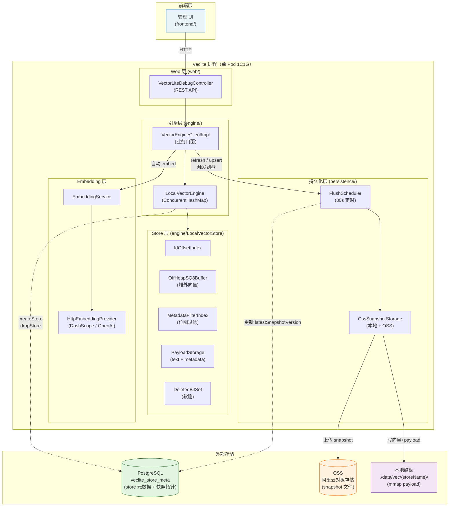
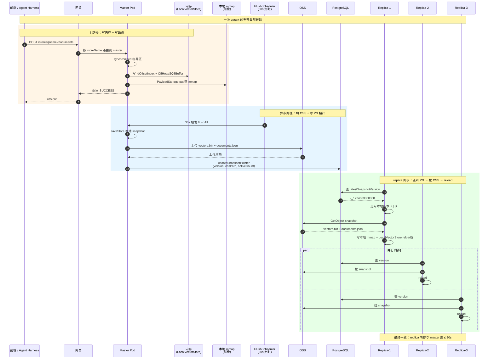
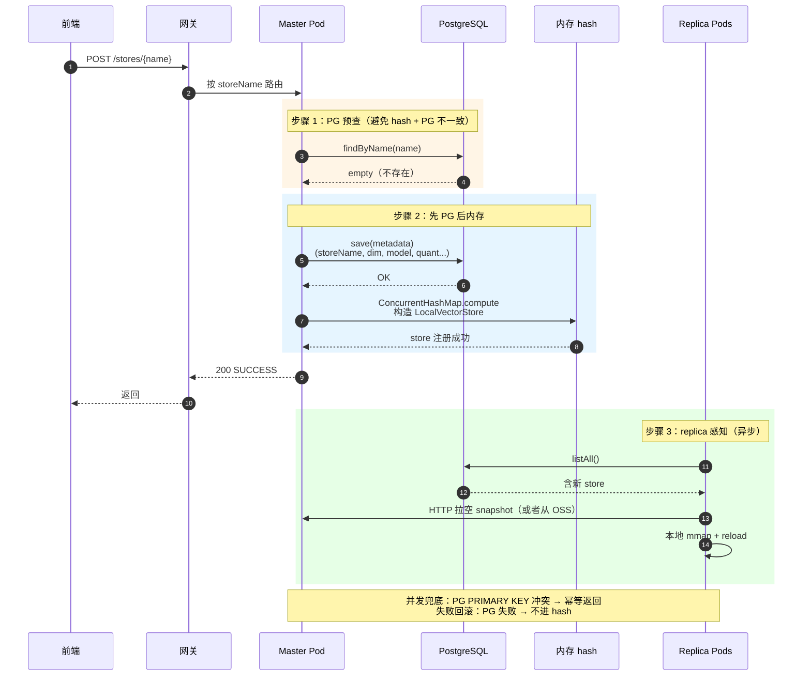
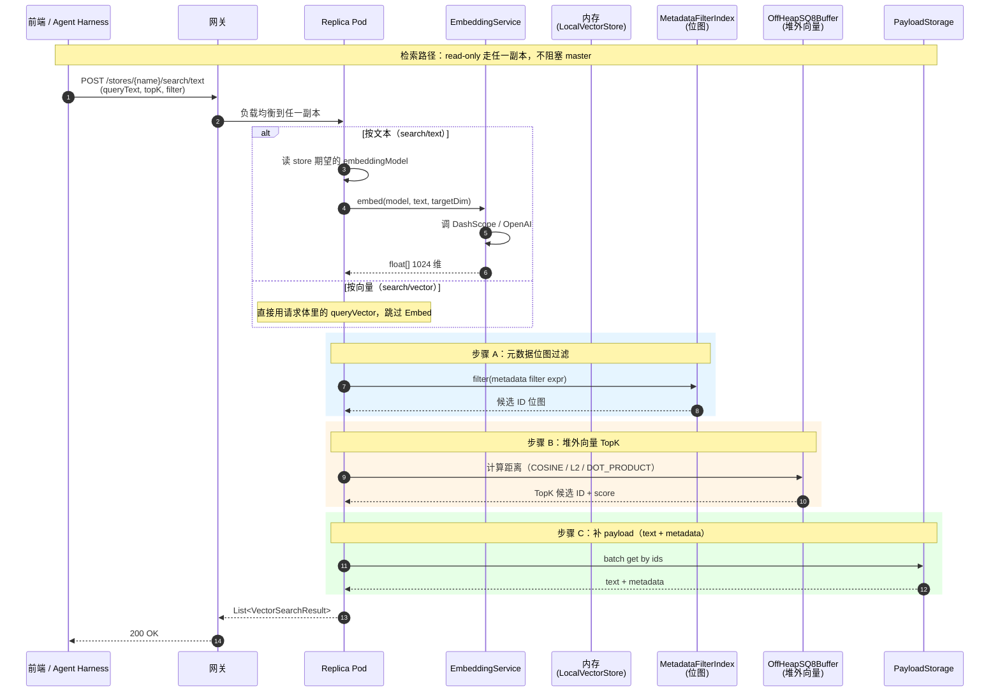
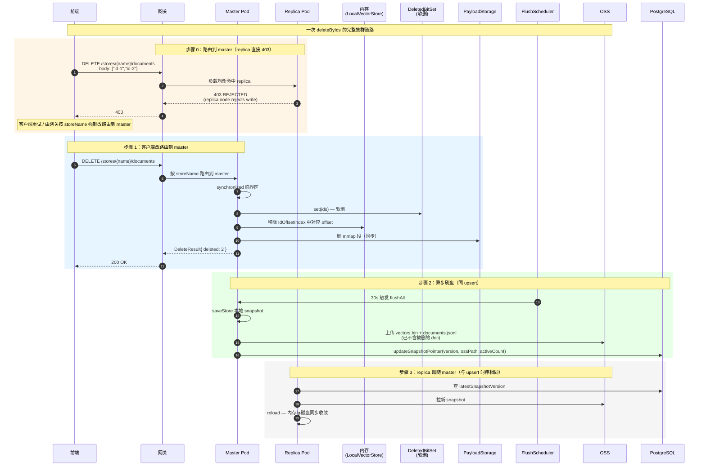
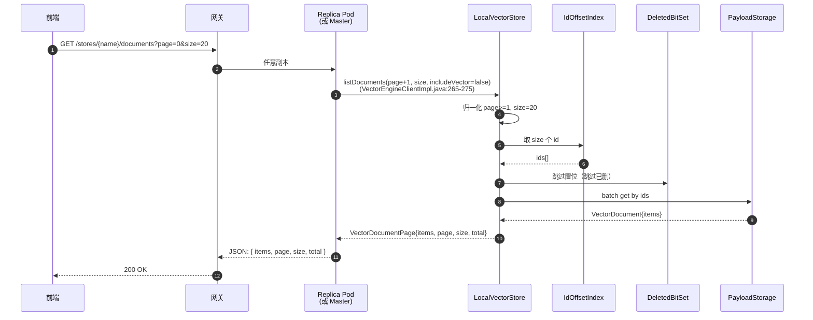
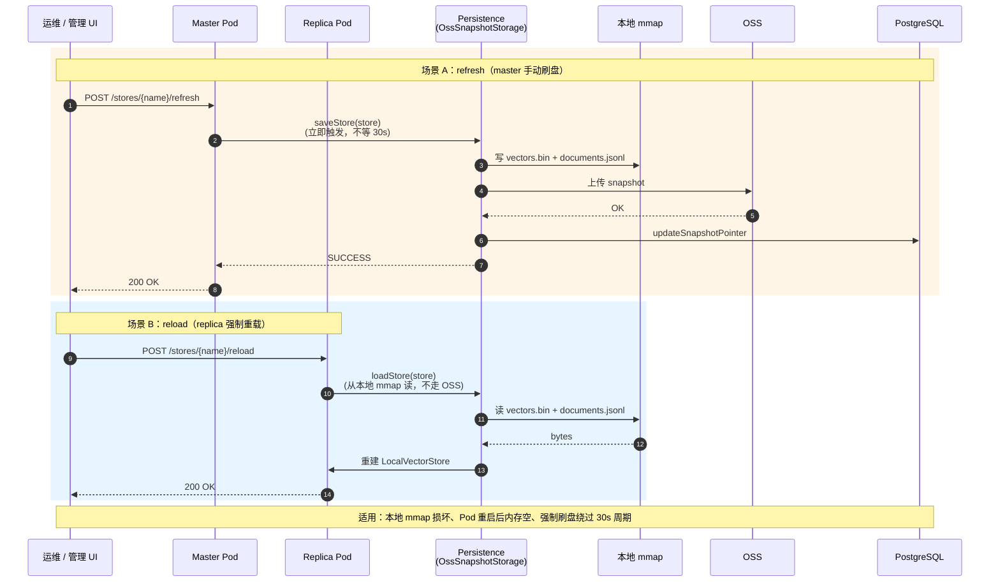

# Veclite 整体架构图

> 三张图：单 Pod 架构图、集群（3 master + 6 replica）架构图、upsert 集群时序图。
> 复制到支持 Mermaid 渲染的 Markdown 查看器（Notion / Confluence / GitHub / VSCode）即可看到。

---

## 图 1：单 Pod 整体架构

---

## 图 2：K8s 集群架构（3 master + 6 replica）

```mermaid
flowchart TB
    subgraph Gateway["网关层（Service Mesh / Ingress）"]
        GW["API Gateway<br/>按 storeName hash<br/>路由到 master / 任意 replica"]
    end

    subgraph Frontend["前端层"]
        UI["管理 UI<br/>(frontend/)"]
        Harness["Agent Harness<br/>(业务方)"]
    end

    subgraph MasterPods["Master Pods (3 个 — 可写)"]
        M1["Master-1<br/>veclite pod<br/>管 store A,B"]
        M2["Master-2<br/>veclite pod<br/>管 store C,D"]
        M3["Master-3<br/>veclite pod<br/>管 store E~J"]
    end

    subgraph ReplicaPods["Replica Pods (6 个 — 只读)"]
        R1["Replica-1"]
        R2["Replica-2"]
        R3["Replica-3"]
        R4["Replica-4"]
        R5["Replica-5"]
        R6["Replica-6"]
    end

    subgraph SharedInfra["共享基础设施（集群唯一）"]
        PG[("PostgreSQL<br/>veclite_store_meta<br/>(9 pod 共享)")]
        OSS[("OSS<br/>阿里云对象存储<br/>(snapshot 仓库)")]
    end

    subgraph LocalCache["每 Pod 本地缓存（9 份）"]
        L1["本地 mmap 缓存<br/>./data/vec/{storeName}/"]
        L2["本地 mmap 缓存"]
        L3["本地 mmap 缓存"]
        L4["本地 mmap 缓存"]
        L5["本地 mmap 缓存"]
        L6["本地 mmap 缓存"]
        L7["本地 mmap 缓存"]
        L8["本地 mmap 缓存"]
        L9["本地 mmap 缓存"]
    end

    UI --> GW
    Harness --> GW

    GW -->|写 createStore/upsert/delete<br/>按 storeName 路由| M1
    GW -->|写| M2
    GW -->|写| M3

    GW -->|读 search/list/stats<br/>负载均衡| R1
    GW -->|读| R2
    GW -->|读| R3
    GW -->|读| R4
    GW -->|读| R5
    GW -->|读| R6

    M1 -.->|写元数据 + 指针| PG
    M2 -.->|写元数据 + 指针| PG
    M3 -.->|写元数据 + 指针| PG

    M1 -->|Push snapshot| OSS
    M2 -->|Push snapshot| OSS
    M3 -->|Push snapshot| OSS

    R1 -.->|查 version| PG
    R2 -.->|查 version| PG
    R3 -.->|查 version| PG
    R4 -.->|查 version| PG
    R5 -.->|查 version| PG
    R6 -.->|查 version| PG

    R1 -->|拉 snapshot| OSS
    R2 -->|拉 snapshot| OSS
    R3 -->|拉 snapshot| OSS
    R4 -->|拉 snapshot| OSS
    R5 -->|拉 snapshot| OSS
    R6 -->|拉 snapshot| OSS

    M1 --- L1
    M2 --- L2
    M3 --- L3
    R1 --- L4
    R2 --- L5
    R3 --- L6
    R4 --- L7
    R5 --- L8
    R6 --- L9

    style PG fill:#e1f5e1,stroke:#2d6a2d,stroke-width:2px
    style OSS fill:#fff3e0,stroke:#e67e22,stroke-width:2px
    style M1 fill:#ffe4e1,stroke:#c0392b
    style M2 fill:#ffe4e1,stroke:#c0392b
    style M3 fill:#ffe4e1,stroke:#c0392b
    style R1 fill:#e8f4f8,stroke:#4a90d9
    style R2 fill:#e8f4f8,stroke:#4a90d9
    style R3 fill:#e8f4f8,stroke:#4a90d9
    style R4 fill:#e8f4f8,stroke:#4a90d9
    style R5 fill:#e8f4f8,stroke:#4a90d9
    style R6 fill:#e8f4f8,stroke:#4a90d9
    style GW fill:#fff8dc,stroke:#daa520,stroke-width:2px
```

---

## 图 3：upsert 集群时序图（master 写 + replica 同步）

---

## 图 4：createStore 集群时序图（含并发一致性）

---

## 图 5：search 集群时序图（按文本 / 按向量）

> 检索是 replica 节点的**主战场**：所有读路径（按向量 / 按文本）都路由到任意副本；按文本检索时副本会**独立调 Embedding 服务**（不依赖 master）。

**关键点**：
- 按文本检索时，replica 节点自己调 Embedding，不绕 master（`engine/VectorEngineClientImpl.java:226`）
- 检索是**纯读**：不会触发 FlushScheduler，不写 PG / OSS
- metadata 过滤走位图（`MetadataFilterIndex`），向量距离走堆外 SQ8 缓冲，两步可独立优化

---

## 图 6：delete 集群时序图（replica 拒绝写）

> 删除走**主路径同步删 + 异步落盘**，与 upsert 链路高度相似。replica 节点**直接 403**。

**关键点**：
- 删除 = 软删位图（`DeletedBitSet`）+ 索引摘除 + payload 删除三步，**全在 synchronized 临界区**（`engine/LocalVectorStore.java:603`）
- replica 拒绝任何写：`web/VectorLiteDebugController.java:42-48` 的 `rejectIfReplica()` 在 upsert / delete / createStore / refresh 4 个写接口前都拦一道
- 集群最终一致时间窗 = `FlushScheduler 周期`（默认 30s）

---

## 图 7：listDocuments 集群时序图（管理型读）

> 文档列表是**管理 / 调试用**接口，不走网关的检索路径，可命中任一副本。

**关键点**：
- 返回结构是**自定义 `VectorDocumentPage`**，字段是 `items` + `total`（`model/VectorDocumentPage.java:13-15`），**不是** Spring Data 的 `content` + `totalElements`——前端解析要按 `items` 取
- 默认 `includeVector=false`（`VectorEngineClientImpl.java:273`），避免 1024 维向量回传压垮管理 UI
- 不走位图检索路径，跳过 `MetadataFilterIndex`

---

## 图 8：refresh / reload 集群时序图（运维向）

> 这两个是**手动运维接口**，不走主路径，主要用于故障恢复 / 强制刷盘。

**关键点**：
- `refresh` 走**主路径 + OSS + PG**（`VectorEngineClientImpl.java:306-309`），与 FlushScheduler 等价但**不等 30s**
- `reload` 只读**本地 mmap**（`VectorEngineClientImpl.java:315-318`），**不走 OSS / PG**——如果本地 mmap 损坏，reload 拿不到数据，得人工干预
- `refresh` / `reload` 这两个接口**replica 也能调**（controller 没加 `rejectIfReplica`）：reload 是只读本地，refresh 在 replica 上等同 noop（replica 不负责刷盘）

---

## 图 9：完整接口表 + replica 读写限制矩阵

> 解决"哪些接口能 / 不能给 replica 调"+"master 唯一 vs 任一副本可读"的查询痛点。

### 9.1 接口总表

| # | 方法 | 路径 | 写 / 读 | 角色限制 | 落盘 | 备注 |
|---|------|------|---------|----------|------|------|
| 1 | GET | `/stores` | 读 | 任一副本 | 否 | 仅返回 store name 列表 |
| 2 | GET | `/stores/_details` | 读 | 任一副本 | 否 | 含 dimension / metric / docCount / storageSource |
| 3 | POST | `/stores/{name}` | 写 | master only | 立即写 PG | createStore；并发兜底靠 PG PRIMARY KEY |
| 4 | GET | `/stores/{name}/stats` | 读 | 任一副本 | 否 | |
| 5 | DELETE | `/stores/{name}` | 写 | master only | 立即写 PG | dropStore；OSS 残留由 OrphanCleanScheduler 兜底 |
| 6 | POST | `/stores/{name}/documents` | 写 | master only | 立即落 mmap；30s 推 OSS | upsert |
| 7 | GET | `/stores/{name}/documents` | 读 | 任一副本 | 否 | 分页；返回 `{items, total}` |
| 8 | POST | `/stores/{name}/search/vector` | 读 | 任一副本 | 否 | 按向量 TopK |
| 9 | POST | `/stores/{name}/search/text` | 读 | 任一副本 | 否 | 按文本 + 自动 embed（replica 独立调 Embedding） |
| 10 | DELETE | `/stores/{name}/documents` | 写 | master only | 立即落 mmap；30s 推 OSS | deleteByIds |
| 11 | POST | `/stores/{name}/reload` | 运维 | master / replica 都可 | 否 | 只读本地 mmap |
| 12 | POST | `/stores/{name}/refresh` | 运维 | master 生效；replica noop | 立即刷盘 | 绕过 30s FlushScheduler |
| 13 | GET | `/_debug/health` | 探活 | 任一节点 | 否 | Spring Bean 注入状态 |
| 14 | GET | `/_debug/embed-test` | 探活 | 任一节点 | 否 | 直接测 EmbeddingProvider |
| 15 | GET | `/_debug/embed-service-test` | 探活 | 任一节点 | 否 | 测 EmbeddingService.embedTexts |
| 16 | GET | `/` 或 `/ui` | UI | 任一节点 | 否 | 转发到 `index.html`（Vue Console 入口） |

### 9.2 Replica 读写限制矩阵

| 写接口 | master | replica | 失败原因 / 行为 |
|--------|--------|---------|----------------|
| POST /stores/{name} | ✅ | ❌ 403 | `rejectIfReplica()` 拦截；replica 不持有 store 写入权 |
| POST /stores/{name}/documents | ✅ | ❌ 403 | 同上 |
| DELETE /stores/{name}/documents | ✅ | ❌ 403 | 同上 |
| DELETE /stores/{name} | ✅ | ❌ 403 | 同上 |
| POST /stores/{name}/refresh | ✅ | ⚠️ 200 (noop) | controller 未拦，但 replica 上等同 noop（不负责刷盘） |
| POST /stores/{name}/reload | ✅ | ✅ | reload 只读本地 mmap，replica 有自己的 mmap |
| 所有 GET / search | ✅ | ✅ | 检索 / 列表 / stats 都可走副本 |

### 9.3 关键代码定位

| 关注点 | 位置 |
|--------|------|
| 写接口拦 replica | `web/VectorLiteDebugController.java:42-48` `rejectIfReplica()` |
| API 路由基路径 | `web/VectorLiteDebugController.java:21` `${veclite.web.base-path:/veclite/api/v1}` |
| 分页返回结构 | `model/VectorDocumentPage.java:13-15` 字段是 `items` + `total`（**不是** Spring Data 的 `content` + `totalElements`） |
| 按文本检索（replica 独立 embed） | `engine/VectorEngineClientImpl.java:226` |
| 软删同步临界区 | `engine/LocalVectorStore.java:603` `synchronized deleteByIds` |
| 列表分页归一化 | `engine/VectorEngineClientImpl.java:271-274`（page 从 1 起，size 默认 20） |
| Reload 只读本地 | `engine/VectorEngineClientImpl.java:315-318` |
| Refresh 立即刷盘 | `engine/VectorEngineClientImpl.java:306-309` |
