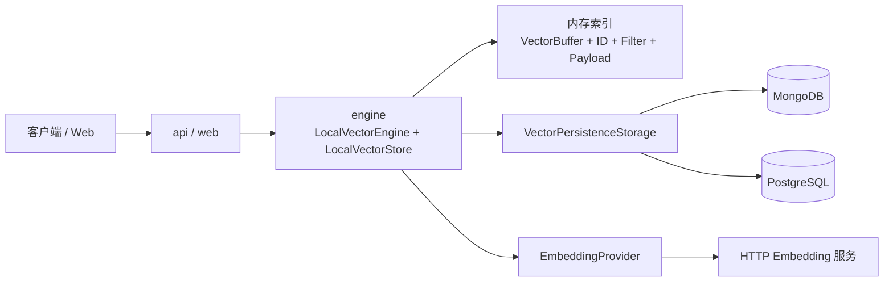
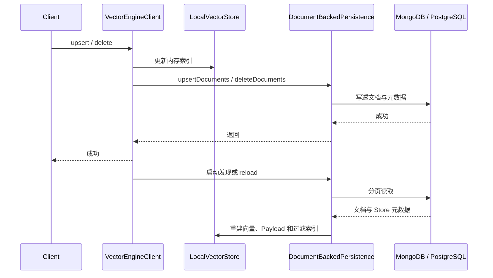
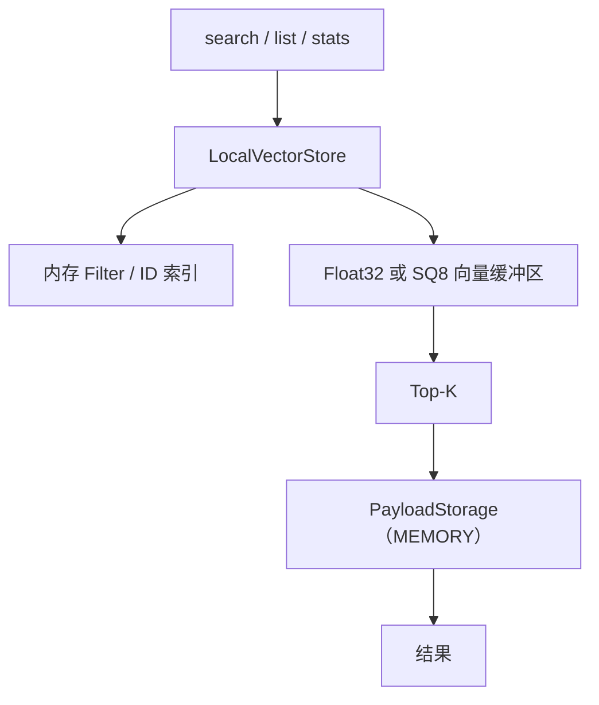

# VecLite 架构图

以下图示对应当前代码：数据库写透持久化，节点内存完成检索。历史版本中的 OSS、文件快照和定时刷盘流程已不再适用。

## 分层与持久化边界

```mermaid
flowchart LR
    Client[客户端 / Web] --> API[api / web]
    API --> Engine[engine\nLocalVectorEngine + LocalVectorStore]
    Engine --> Memory[内存索引\nVectorBuffer + ID + Filter + Payload]
    Engine --> Port[VectorPersistenceStorage]
    Port --> Mongo[(MongoDB)]
    Port --> Postgres[(PostgreSQL)]
    Engine --> Embed[EmbeddingProvider]
    Embed --> Http[HTTP Embedding 服务]
```

## 写入与恢复

```mermaid
sequenceDiagram
    participant C as Client
    participant E as VectorEngineClient
    participant S as LocalVectorStore
    participant P as DocumentBackedPersistence
    participant DB as MongoDB / PostgreSQL

    C->>E: upsert / delete
    E->>S: 更新内存索引
    E->>P: upsertDocuments / deleteDocuments
    P->>DB: 写透文档与元数据
    DB-->>P: 成功
    P-->>E: 返回
    E-->>C: 成功

    E->>P: 启动发现或 reload
    P->>DB: 分页读取
    DB-->>P: 文档与 Store 元数据
    P->>S: 重建向量、Payload 和过滤索引
```

## 查询路径

```mermaid
flowchart TD
    Q[search / list / stats] --> S[LocalVectorStore]
    S --> F[内存 Filter / ID 索引]
    S --> V[Float32 或 SQ8 向量缓冲区]
    V --> K[Top-K]
    K --> R[PayloadStorage（MEMORY）]
    R --> Out[结果]
```
