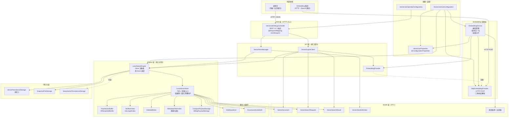
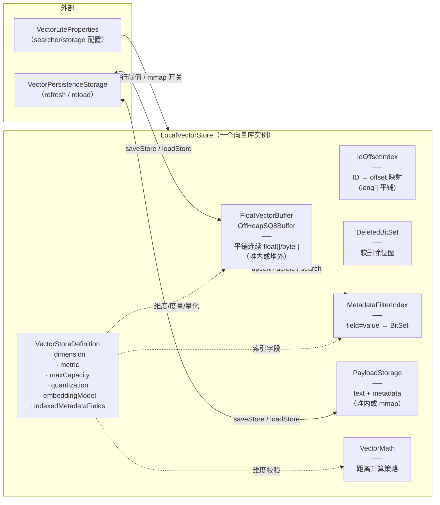

# VecLite 架构图（Architecture Overview）

> 基于 `src/main/java/veclite` 源码逆向绘制。  
> 图 1 展示 **分层与模块依赖**；图 2 展示 **运行时对象关系**（一个 Store 实例化后的内部构成）。

## 图 1：分层架构

### 分层职责

| 层 | 包 | 职责 | 是否可被上层替换 |
|---|---|---|---|
| **Web** | `veclite.web` | Spring MVC 暴露 HTTP 端点 | 可关（`veclite.web.enabled=false`） |
| **API** | `veclite.api` | 客户端可见的接口契约 | 是接口，可多实现 |
| **Embedding** | `veclite.embedding` | 外部 Embedding 服务的 HTTP 适配 | `EmbeddingProvider` 可替换为本地 ONNX 实现 |
| **Engine** | `veclite.engine` | 内存向量库核心（索引 / 缓冲区 / 过滤） | `LocalVectorEngine` 是默认实现 |
| **Quant / Math** | `veclite.quantization` `veclite.math` | SQ8 量化 + 距离计算 | `VectorMath` 可替换 native 实现 |
| **Persistence** | `veclite.persistence` | 内存 → 磁盘的快照序列化 | `VectorPersistenceStorage` 可替换 |
| **Config** | `veclite.config` | Spring Boot 自动装配 + 配置绑定 | — |
| **Model** | `veclite.model` | 跨层传输的 DTO / 枚举 | — |

---

## 图 2：LocalVectorStore 内部结构（运行时对象图）

### 6 大组件的协作关系

| 组件 | 文件 | 内存布局 | 关键作用 |
|---|---|---|---|
| `FloatVectorBuffer` / `OffHeapSQ8Buffer` | `engine/FloatVectorBuffer.java` `engine/OffHeapSQ8Buffer.java` | 平铺 `float[]` 或 `byte[]`（堆外 DirectByteBuffer） | 存原始向量本体，连续访问 = 缓存友好 |
| `IdOffsetIndex` | `engine/IdOffsetIndex.java` `engine/IntLongIdIndex.java` | 开放寻址 `long[]` 字典 | ID ↔ 缓冲区下标，**避免 HashMap 装箱** |
| `DeletedBitSet` | `engine/DeletedBitSet.java` | `BitSet` | 软删除标记，**延迟回收**避免写时拷贝 |
| `MetadataFilterIndex` | `engine/MetadataFilterIndex.java` | 倒排位图 | 过滤时给一个候选 BitSet，**纳秒级** |
| `PayloadStorage` | `engine/CompactPayloadStorage.java` `engine/MMapPayloadStorage.java` | 堆内 Map 或 mmap 文件 | text + metadata 不进主检索堆 |
| `VectorMath` | `math/PureJavaVectorMath.java` | 函数指针 | COSINE / EUCLIDEAN / DOT_PRODUCT 距离 |

---

## 关键设计约束

- **强一致**：所有组件通过 `offset`（缓冲区下标）关联，写入时**先追加再回填 ID**，避免中途崩溃出现 ID 指向不存在的 offset
- **软删除**：删除只翻 `DeletedBitSet` 的位，**物理回收延迟**，检索时跳过
- **量化漂移防护**：SQ8 的 per-dimension 校准用前 N 条向量冻结参数，写入新向量时**不重新校准**
- **零 GC 热路径**：Top-K 候选用 `PriorityQueue`，循环内**零临时分配**（v2.4 重点优化）
