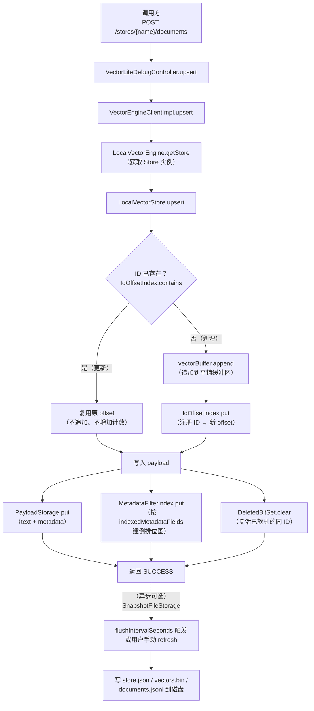
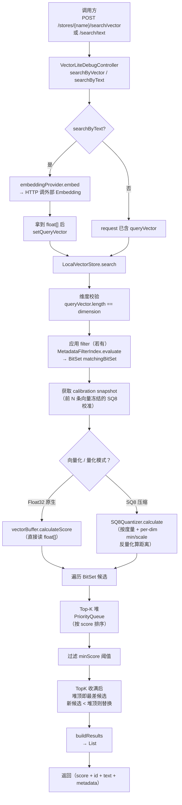
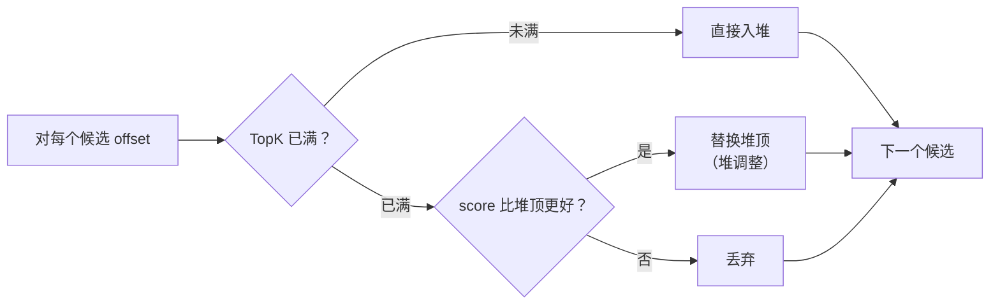

# VecLite 核心流程图

> 三张图覆盖三大关键操作：**写入流程**、**检索流程**、**持久化流程**。
> 基于 `engine/LocalVectorStore.java` 和 `engine/VectorEngineClientImpl.java` 逆向绘制。

---

## 图 1：写入流程（upsert 单条文档）

### 关键不变量

| 不变量 | 保证机制 |
|---|---|
| 同一个 ID 不会产生两个 offset | 写入前查 `IdOffsetIndex`，已存在则复用 |
| offset 不会指向未写入的位置 | 先 `vectorBuffer.append` 再 `IdOffsetIndex.put`（顺序保证） |
| 软删除的同 ID 重新 upsert 会"复活" | `DeletedBitSet.clear(id)` 翻位 |
| 软删除的同 ID 重新 upsert **offset 不变** | 更新分支走"复用原 offset"，不追加 |

---

## 图 2：检索流程（search）

### Top-K 堆的剪枝逻辑

- **EUCLIDEAN**：score 越小越好，堆顶是**最大** score
- **COSINE / DOT_PRODUCT**：score 越大越好，堆顶是**最小** score
- 实现见 `LocalVectorStore.java:569-577` 的 `offerCandidate` 方法

---

## 图 3：持久化流程（refresh / reload）

```mermaid
flowchart TD
    subgraph Refresh["refresh（内存 → 磁盘）"]
        R1["调用方 POST /stores/{name}/refresh"] --> R2["VectorEngineClientImpl.refresh"]
        R2 --> R3["persistence.saveStore(store)"]
        R3 --> R4{"StorageType"}
        R4 -- "NOOP" --> R5["空操作"]
        R4 -- "SNAPSHOT_FILE" --> R6["SnapshotFileStorage.saveStore"]
        R6 --> R7["1. 创建 {name}.tmp 临时目录"]
        R7 --> R8["2. 写 store.json<br/>（维度/度量/模型）"]
        R8 --> R9["3. 写 vectors.bin<br/>（未删除向量平铺）"]
        R9 --> R10["4. 写 documents.jsonl<br/>（id + text + metadata）"]
        R10 --> R11["5. ATOMIC_MOVE<br/>临时目录 → 正式目录"]
        R11 --> R12["（写盘过程对崩溃安全）"]
    end

    subgraph Reload["reload（磁盘 → 内存）"]
        L1["调用方 POST /stores/{name}/reload<br/>或应用启动时自动"] --> L2["VectorEngineClientImpl.reload"]
        L2 --> L3["persistence.loadStore(store)"]
        L3 --> L4["1. 读 store.json 恢复定义"]
        L4 --> L5["2. 读 vectors.bin 重建 vectorBuffer"]
        L5 --> L6["3. 读 documents.jsonl 重建 payload"]
        L6 --> L7["4. 重建 IdOffsetIndex"]
        L7 --> L8["5. 重建 MetadataFilterIndex"]
    end
```

### 持久化的关键不变量

- **不写半成品**：`.tmp` 目录 + `ATOMIC_MOVE`（`SnapshotFileStorage.java:56-60`）—— 写到一半崩了，旧文件还在
- **写的是未删除的向量**：`DeletedBitSet` 的位会被跳过，所以"已删但物理还在"的向量不会写盘
- **不自动刷盘**：写入只改内存，**`flushIntervalSeconds` 是应用启动时的兜底定时器**（`SnapshotFileConfig.flushIntervalSeconds=30` 默认 30 秒）—— 你不点 refresh、也不等定时器，数据就只在内存
