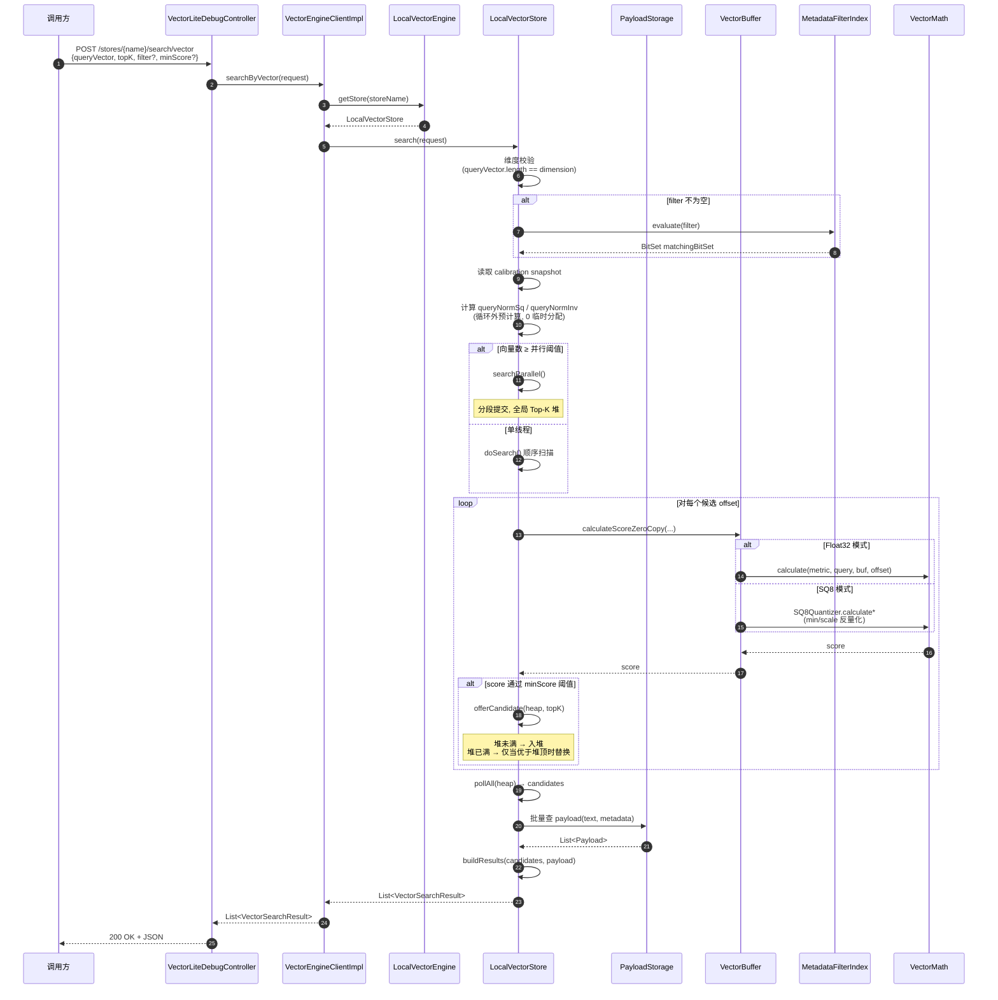
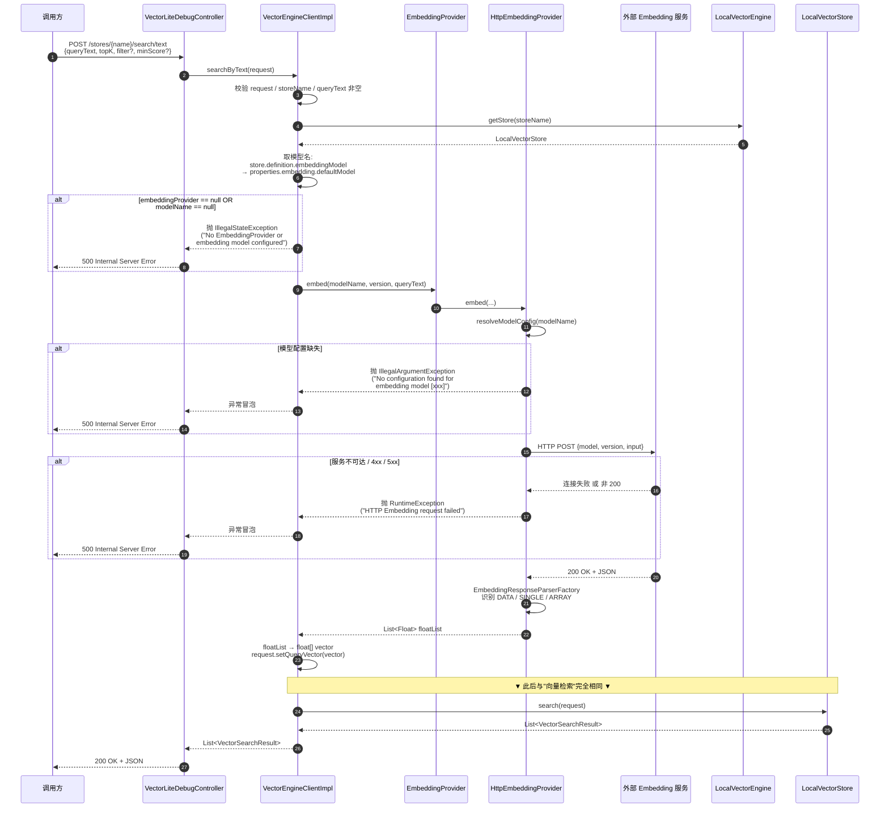
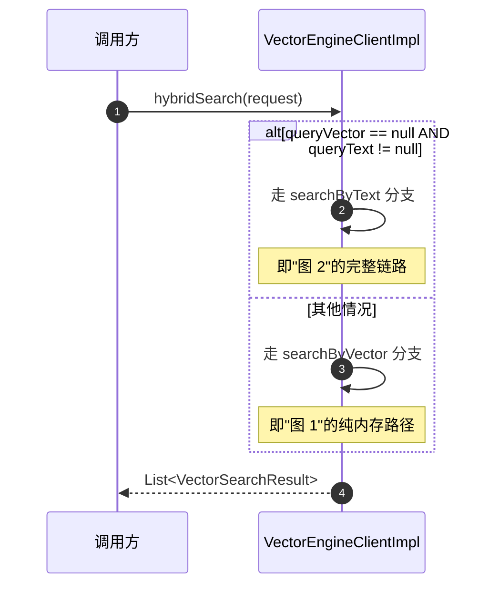

# VecLite 检索时序图

> 三张图覆盖三种检索方式的**跨层调用顺序**：向量检索、文本检索、混合检索。
> 重点说明：**文本检索 = "向量化 + 向量检索"两步走**，`hybridSearch` 当前是**文本优先 fallback**。

---

## 图 1：向量检索（searchByVector）



### 关键观察

- **零外部 HTTP 调用**：纯内存运算，**不依赖任何外部服务**
- **零 GC 压力**：循环内只有基本类型计算，**无对象分配**（v2.4 重点）
- **filter 是按位与**：先过滤再算距离，**比"算完再过滤"省 10x ~ 1000x**
- **Top-K 堆自带剪枝**：TopK 满了之后，差于堆顶的候选直接丢弃，**不需要全排序**

---

## 图 2：文本检索（searchByText）



### 文本检索 vs 向量检索

| 维度 | 向量检索 | 文本检索 |
|---|---|---|
| **HTTP 调用次数** | 0（纯内存） | 1（前端）+ 1（后端 Embedding） |
| **延迟组成** | 计算耗时 | 网络 + Embedding 推理 + 计算 |
| **依赖** | 无 | 后端必须配 `veclite.embedding.models` |
| **前端额外配置** | 无 | 需配 `embedSource` + `embedUrl` 或后端 Embedding |
| **失败模式** | 几乎不会失败 | 500（最常见于 Embedding 服务不可用） |

### 500 错误的常见根因（按概率排）

1. **后端没配 `veclite.embedding.models`** —— `IllegalArgumentException: No configuration found for embedding model [xxx]`
2. **Embedding 服务 URL 不可达** —— `RuntimeException: HTTP Embedding request failed ... Connection refused`
3. **Embedding 服务需要鉴权** —— VecLite 不自动加 `Authorization` header，**直接 401**
4. **CORS 拦截** —— 浏览器层面就被拦，**请求根本没发出去**（不是 500，是 network error）
5. **响应格式不在支持列表** —— `data` / `embedding` / 顶层数组 三种都不匹配

---

## 图 3：混合检索（hybridSearch）



### 当前实现（v2.4）

`VectorEngineClientImpl.java:143-148`：

```java
public List<VectorSearchResult> hybridSearch(VectorSearchRequest request) {
    if (request.getQueryVector() == null && request.getQueryText() != null) {
        return searchByText(request);   // 文本 fallback
    }
    return searchByVector(request);     // 向量 fallback
}
```

**这并不是真正的"混合"**——只是根据入参**二选一**：
- 没传向量但传了文本 → 走文本（自动向量化）
- 其他情况 → 走向量

**真正的"混合检索"语义**（向量相似度 + 关键字匹配 + metadata 过滤加权）在当前 v2.4 **未实现**，是 roadmap 项。

---

## 三种检索的"该不该用"

| 场景 | 推荐 | 理由 |
|---|---|---|
| **RAG 检索** | 文本检索 | 用户输入自然语言，需要自动向量化 |
| **已知 query embedding 的批量回灌** | 向量检索 | 跳过 Embedding 调用，**延迟最低** |
| **前端 demo** | 文本检索 | 用户体验最好，"输入文字就出结果" |
| **后端服务间调用** | 向量检索 | 服务自己算 embedding，避免重复调用 |
| **混合检索需求** | 暂用文本检索 + metadata filter 替代 | 等 v2.5+ 的真正混合实现 |
