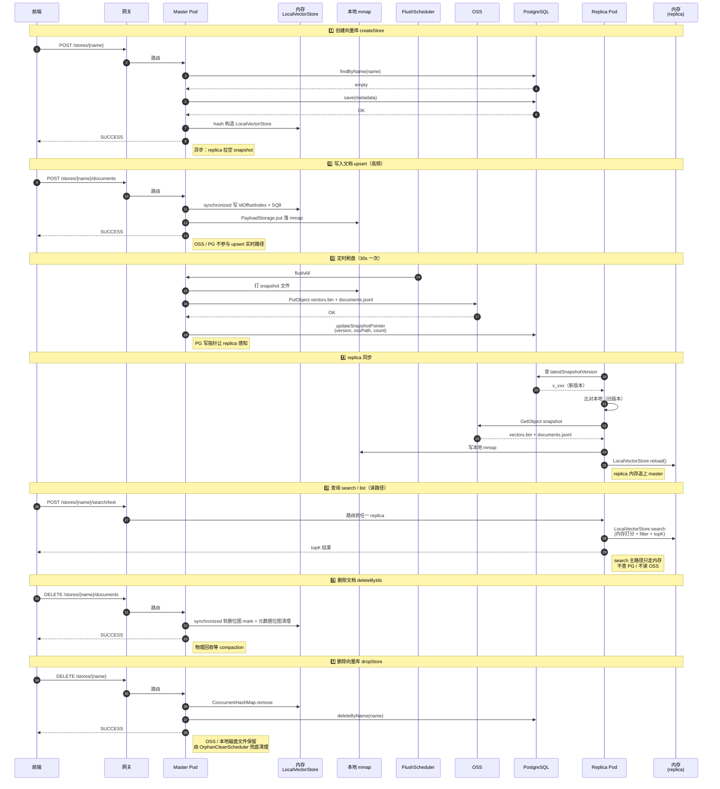

# Veclite 集群完整时序图

> 单图覆盖：createStore / upsert / search / listDocuments / deleteByIds / dropStore 全部接口的集群链路。
> 复制到支持 Mermaid 渲染的 Markdown 查看器（Notion / Confluence / GitHub / VSCode）即可看到。

---

## 关键观察

| 接口 | 实时路径走哪些 | 异步路径走哪些 | 集群化需要改 |
|---|---|---|---|
| createStore | 内存 + PG | — | 加 master 校验 + PG 预查 + 失败回滚 |
| upsert | 内存 + 本地 mmap | OSS + PG（30s） | 加 master 校验 + replica 同步机制 |
| search | 内存 | — | 不需要改（replica 内存有数据就查） |
| listDocuments | 内存 | — | 不需要改 |
| deleteByIds | 内存 | OSS + PG（30s） | 加 master 校验 |
| dropStore | 内存 + PG | — | 加 master 校验 + 孤儿清理 |
