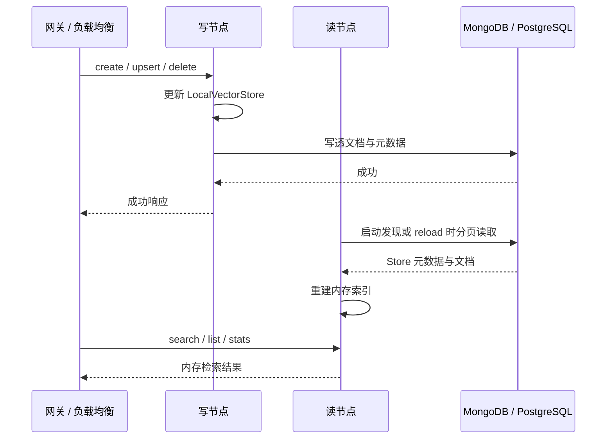

# VecLite 集群时序

当前实现不包含节点间同步调度器。每个节点启动时从共享数据库恢复 Store，写请求由部署层固定路由到负责节点。

```mermaid
sequenceDiagram
    participant G as 网关 / 负载均衡
    participant W as 写节点
    participant R as 读节点
    participant DB as MongoDB / PostgreSQL

    G->>W: create / upsert / delete
    W->>W: 更新 LocalVectorStore
    W->>DB: 写透文档与元数据
    DB-->>W: 成功
    W-->>G: 成功响应

    R->>DB: 启动发现或 reload 时分页读取
    DB-->>R: Store 元数据与文档
    R->>R: 重建内存索引
    G->>R: search / list / stats
    R-->>G: 内存检索结果
```

一致性、故障转移和跨节点副本刷新由网关与数据库部署方案负责；本项目只保证单节点引擎与数据库端口的行为。
